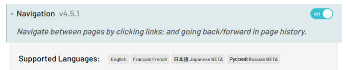
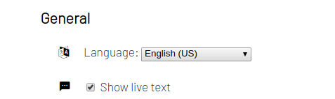

# Internationalization

_LipSurf was designed from the ground-up with multi-language support in mind._


LipSurf uses the built-in HTML5 speech-recognizer, hence it supports all of the languages that
the Google speech recognizer does, in theory.

::: tip
For a list of supported languages see here: <https://cloud.google.com/speech-to-text/docs/languages>
:::

The base language is English, but any plugin can have its metadata and match phrases/functions adjusted to be compatible with other languages.

The languages that a given plugin supports are shown in the options.



Once a user has at least one plugin installed that supports a given language, they can switch to that language in the general options.



## Example
Let's localize the [hello world plugin](/quick-start.md#hello-world-plugin) from the quick start guide earlier.

 1. Create a new file `HelloWorld.ja.ts` in the `HelloWorld` folder where in this case `ja` is the [ISO 639-1](https://en.wikipedia.org/wiki/List_of_ISO_639-1_codes) language code for Japanese, what we're localizing for in this example.

 2. Import the English (base) plugin so we can reference it and extend it's language property.

 ```ts
 /// lipsurf-plugins/src/HelloWorld/HelloWorld.ja.ts
 /// <reference types="lipsurf-types/extension"/>
 import HelloWorld from './HelloWorld';
 ```

  3. Set `Plugin.languages!.ja` to the localizeable things.

::: warning
`Plugin.languages` needs a non-null assertion operator.
:::

  You can localize all the things that make sense to: nice names (the pretty ones🌼), descriptions, match patterns etc.

  The `commands` property should be an object with keys of command names that map to the English command names they localize and of type [`ILocalizedCommand`](/api-reference/command.md#ilocalizedcommand)).

<<< @/docs/assets/HelloWorld.ja.ts
