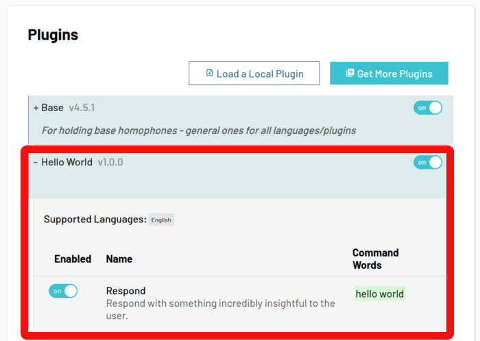

# 5 Minute Quick Start

## Hello World Plugin

Let's create a simple "Hello World" plugin that responds with a JavaScript alert "Hello, Developer!" when a user says <span class="voice-cmd">hello world</span>.

 1. Install the LipSurf CLI.

 ```sh
 yarn global add @lipsurf/cli
 ```

 2. Scaffold a project.

 ```sh
 lipsurf-cli init HelloWorld && cd lipsurf-plugin-helloworld
 ```

 The most important bit is the plugin created in `src/HelloWorld/HelloWorld.ts`. It should be something like this:

@[code ts](./assets/HelloWorld.ts)

  The meat of the plugin lives in the array of commands. Each [Command](/api-reference/command.md) object has a `match` property for what the user needs to say to run it, a `pageFn` property for the code that's actually run and a bunch of meta properties like `name`, `description` etc.

 ::: tip NOTE
 If you change the plugin id, "HelloWorld" in this case, make sure to change the directory name as well so it matches.
 :::

  3. Compile our TypeScript file and make the LipSurf plugin.

  ```sh
  yarn watch
  ```

::: tip NOTE
This will watch our *.ts files for changes and compile them to JavaScript, and finally a LipSurf plugin whenever a change is detected :)
:::

 4. Time to _load 'er up_. Open up Google Chrome and right click the LipSurf icon then "Options".

 5. Turn on "Developer mode" by checking its box.

 

 6. Click "Load a Local Plugin" under "Plugins" and navigate to the compiled `.ls` file `dist/HelloWorld.1-0-0.0.ls`.

 ::: tip NOTE
 The `ls` extension is special for LipSurf extensions. It's basically 3 JavaScript files rolled into one.
 :::

 

<br>

:checkered_flag: &nbsp;&nbsp;  **That's it!**  &nbsp;&nbsp; :checkered_flag:

<br>

---

## Verifying

  After a few seconds your plugin should appear in the plugins list if there were no installation problems.

::: tip
Check the developer console (&lt;F12&gt;) for hints if there are installation issues.
:::

  

  Now try saying <span class="voice-cmd">hello world</span> in any tab (since this plugin has a catch-all `/.*/` regex for the `match` property it should run on any non-special URL).

  If everything went smoothly, you should see a JavaScript alert like this one:

  


---


  You can also say <span class="voice-cmd">help</span> to see your new command listed in the auto-generated help overlay.

  

---

## What's Next
  If you think that's nifty, we've just scratched the surface! LipSurf can handle homophones, dynamic match commands, multiple languages and more!

  Check out the "Advanced" topics after you take a deep breath and regain your composure from all this excitement!


