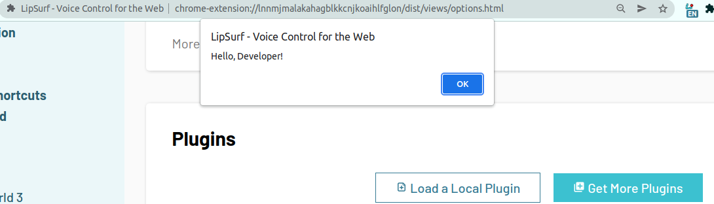
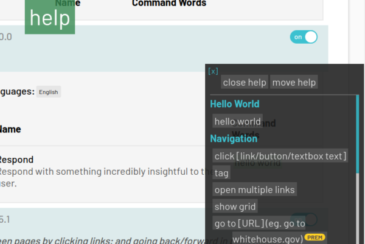

# 5 Minute Quick Start

## Hello World Plugin

Let's create a simple "Hello World" plugin that responds with a JavaScript alert "Hello, Developer!" when a user says <span class="voice-cmd">hello world</span> on a tab with a *.lipsurf.com domain.

 1. Clone the community plugins repository and change into the directory.

 ```sh
 git clone https://github.com/LipSurf/plugins.git lipsurf-plugins
 cd lipsurf-plugins
 ```

 2. Install the dependencies.

 ```sh
 yarn
 ```

 3. Create a folder named `HelloWorld` in `src` with a `HelloWorld.ts` file in it with the following contents:

::: warning
It's important to keep the folder name and plugin name the same. Please use PascalCasing.
:::
::: tip PROTIP
Rather than copying and pasting, it's better to type out the code to better grasp its intuitive structure and contents.
:::

<<< @/docs/assets/HelloWorld.ts

  The meat of the plugin lives in the array of commands. Each [Command](/api-reference/command.md) object has a `match` property for what the user needs to say to run it, a `pageFn` property for the code that's actually run and a bunch of meta properties like `name`, `description` etc.

  4. Since we're doing the example in TypeScript, we need to compile down to JavaScript.

  ```sh
  yarn watch
  ```

::: tip NOTE
This will watch our *.ts files for changes and compile them to JavaScript whenever a change is detected :)
:::

 5. Time to _load 'er up_. Open up Google Chrome and right click the LipSurf icon then "Options".

 6. Turn on "Developer mode" by checking its box.

 

 7. Click "Add a Local Plugin" under "Plugins" and navigate to the compiled `.ls` file (eg. `plugins/dist/HelloWorld.1-0-0.0.ls`).

 ::: tip NOTE
 The `ls` extension is special for LipSurf extensions. It's basically 3 JavaScript files rolled into one.
 :::

 

<br>

:checkered_flag: &nbsp;&nbsp;  **That's it!**  &nbsp;&nbsp; :checkered_flag:

<br>

---

## Verifying

  After a few seconds your plugin should appear in the plugins list if there were no installation problems.

::: tip
Check the developer console (&lt;F12&gt;) for hints if there are installation issues.
:::

  

  Now try saying <span class="voice-cmd">hello world</span> on this tab (since this tab has a lipsurf.com domain it will match our url pattern).

  If everything went smoothly, you should see a JavaScript alert like this one:

  


---


  You can also say <span class="voice-cmd">help</span> to see your new command listed in the auto-generated help overlay.

  

---

## What's Next
  If you think that's nifty, we've just scratched the surface! LipSurf can handle homophones, dynamic match commands, multiple languages and more!

  Check out the "Advanced" topics after you take a deep breath and regain your composure from all this excitement!


